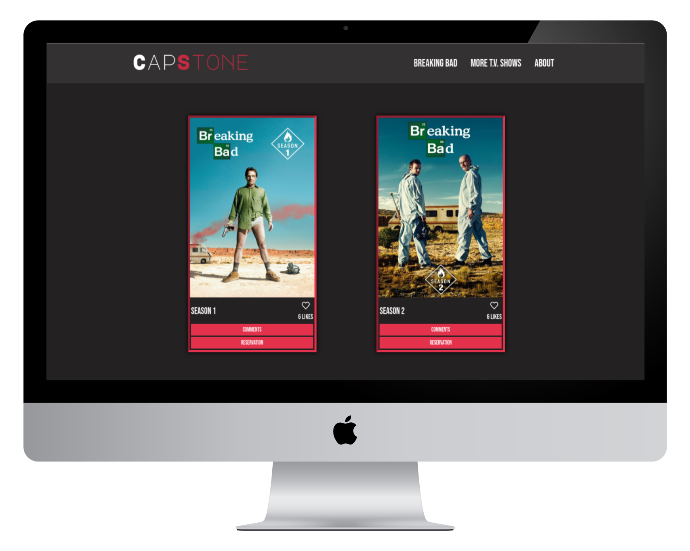

# Project - JavaScript Group Capstone
This is the JavaScript capstone project. We've used [This API](https://api.tvmaze.com/shows/169/seasons) to get the list of Breaking Bad seasons. This is the involvement [API](https://www.notion.so/Involvement-API-869e60b5ad104603aa6db59e08150270) we've used store likes and comments.



## Built With

- HTML
- CSS
- JavaScript
- webpack
- jest for testing

## Live Demo
[Live Demo Link](https://jasonfelice.github.io/Group-Capstone/)

## Install

Download all dependencies after cloning this repository. Run:
```
npm install
```

To get a local copy up and running follow these simple example steps.
- Copy this [link](https://github.com/jasonfelice/Group-Capstone)
- Open the terminal
- Run "git clone" and paste the link
- Install dependencies 
- Open this folder in your code editor
- Create a feature branch to work on
- Now you can edit and make a pull request

## Authors

👤 **Jason Felice**

- GitHub: [@jasonfelice](https://github.com/jasonfelice)
- LinkedIn: [LinkedIn](https://www.linkedin.com/in/jason-felice-11a5a622b/)


👤 **Haji Bamsi**

- GitHub: [@bamsi](https://github.com/bamsi)
- LinkedIn: [LinkedIn](https://www.linkedin.com/in/haji-bamsi-17327726/)

## 🤝 Contributing

Contributions, issues, and feature requests are welcome!

Feel free to check the [issues page](../../issues/).

## Acknowledgments
Favicon by [Icons8](https://icons8.com/icon/57214/tv-show)

## 📝 License

This project is [MIT](./MIT.md) licensed.